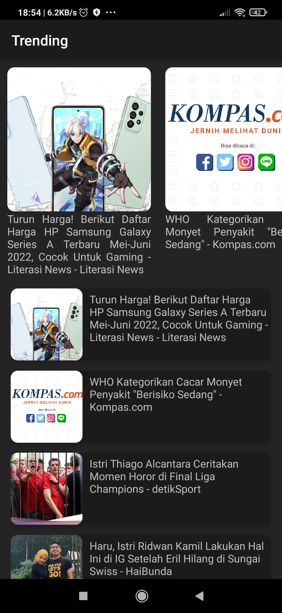

# UAS-PAM-APP
Ujian Akhir Semester Pengembangan Aplikasi Mobile (Individu)

# IDENTITAS MAHASISWA
Nama  : Muhammad Farisi Zatwara Putraa Unyi

NIM   : 119140201

Kelas : PAM RB

# PENJELASAN APLIKASI
Aplikasi ini adalah Aplikasi NEWS yang dibuat menggunakan React Native. Anda dapat membaca NEWS yang sedang tren atau jika mau, Anda dapat membacanya berdasarkan kategori.

Framework dan aplikasi pendukung yang digunakan dalam membangun aplikasi ini:
- React Native.
- Android Studio.
- Visual Code Studio.

# KATEGORI BERITA
- Entertainment
- Business 
- Health
- Politics
- Technology
- Sports

# CARA INSTALASI
1. Download Terlebih Dahulu Aplikasi Pada Link Berikut: https://bit.ly/News-App-119140201
2. Selanjutnya instal aplikasi yang telah didownload di hp android.
3. Aplikasi siap digunakan.

# CARA PENGGUNAAN
<b>1. Buka aplikasi News App.</b>

<b>2. Pilih Kategori berita.</b>

<b>3. Atau langsung pilih berita yang sedang trending.</b>

<b>4. Pengguna akan dibawa ke portal berita yang dipilih.</b>

